# Amazon VPC使用ガイド

## Amazon VPC

* AWSが提供する仮想ネットワークサービス
* AWS上でインフラを構築する際に最初にVPCというネットワークを構築する

## 必要知識

### リージョン

* AWSの各サービスが提供されている地域のこと
* リージョンによって使えるサービスが異なる

### アベイラビリティゾーン

* リージョンに存在する互いに独立したデータセンタのこと
* 複数のアベイラビリティゾーンにサブネットを作成しておくと冗長性が向上する(ベストプラクティス)

### IPアドレス

* インターネット上の住所
* パブリックIPアドレス
  * インターネットに接続するときに使用するIPアドレス
  * 重複しないようにICANNが管理する
  * プロバイダー、サーバ事業者から貸し出される
* プライベートIPアドレス
  * インターネットで使用されないIPアドレス
  * 決められた範囲内で自由に使用することができる

## VPC作成実践

* インターネットと接続できるVPCを作成します
* 全体像は以下図を参照


1. VPCを作成する
   1. リージョン選択
   2. VPCをクリック
   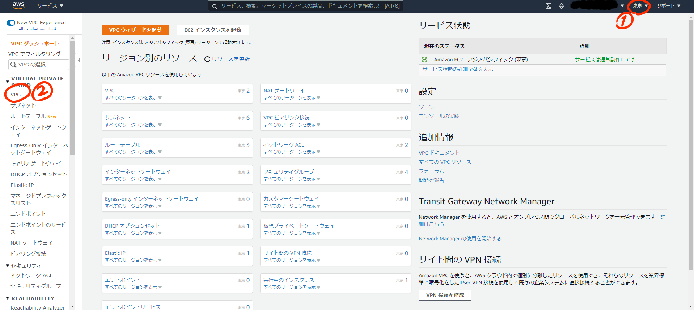
   3. VPCを作成をクリック
   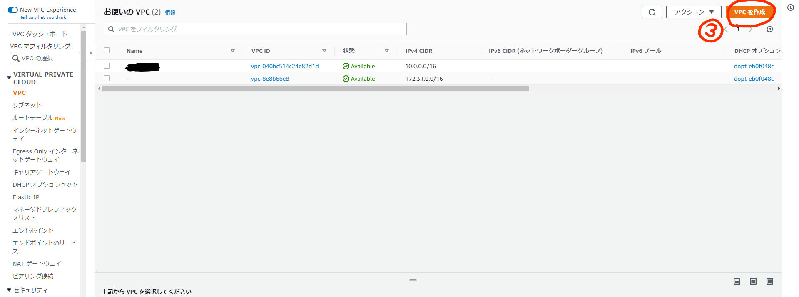
   4. VPC名の入力
   5. IPアドレスを入力  
        ※テナンシー：物理ハードウェアを占有するオプション。EC2などの料金が高くなる。
   6. VPCを作成をクリック
   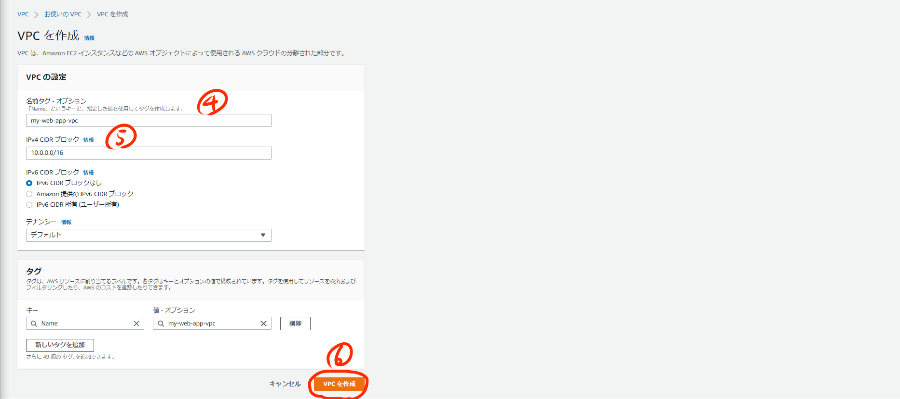
2. サブネットを作成する(メリット：耐障害性、セキュリティの強化)
   1. サブネットをクリック
   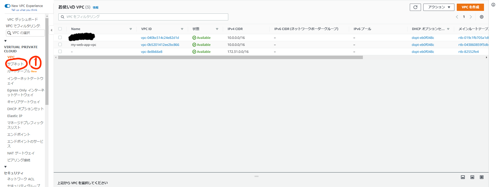
   2. サブネットを作成をクリック
   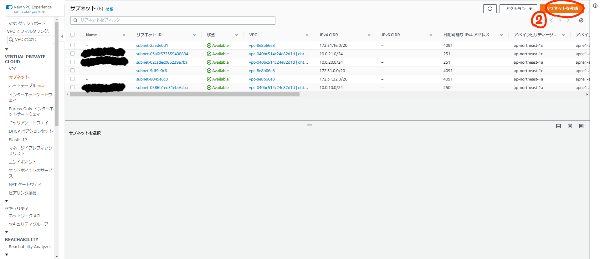
   3. VPCに紐づける
   4. サブネット名を入力
   5. サブネットを作成するアベイラビリティゾーンを選択
   6. IPアドレスを入力
   7. サブネットを作成をクリック
   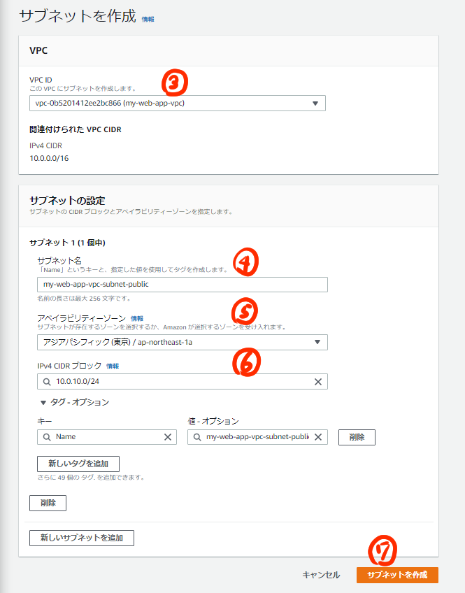
   8. 必要なサブネットの数だけ、1～6を繰り返す
3. ルーティング設定する
   1. インターネットゲートウェイをクリック
   2. インターネットゲートウェイの作成をクリック
   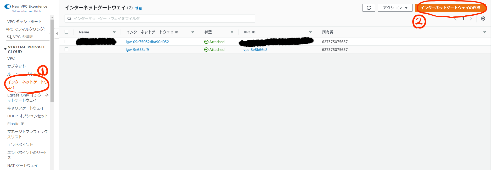
   3. ゲートウェイ名を入力
   4. インターネットゲートウェイの作成をクリック
   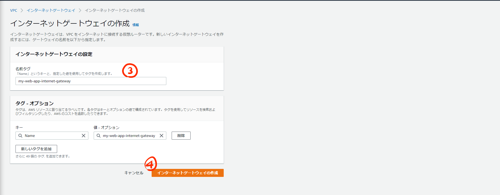
   5. VPCにアタッチ
   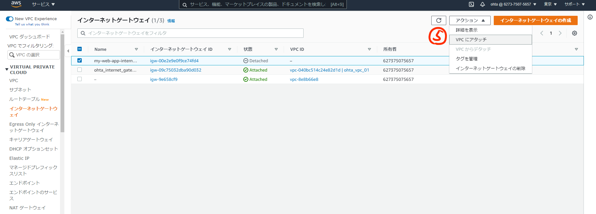
   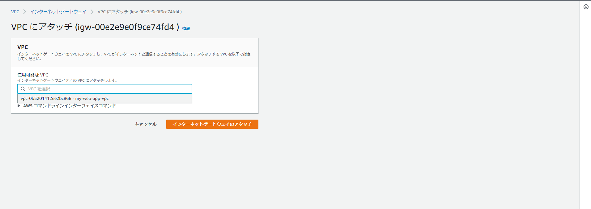
   6. ルートテーブルを作成をクリック
   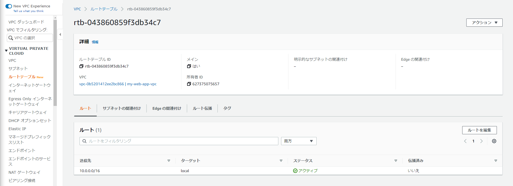
   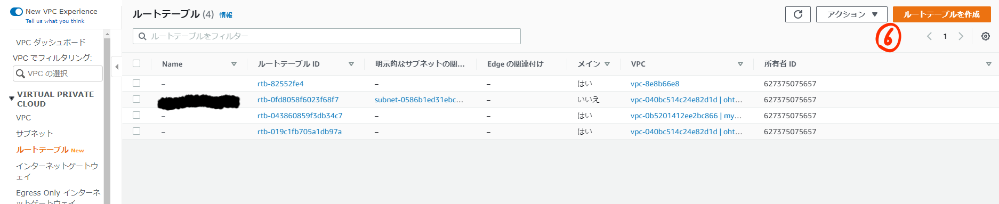
   7. ルートテーブル名を入力
   8. ルートテーブルを使用するVPCを入力
   9. ルートテーブルを作成をクリック
   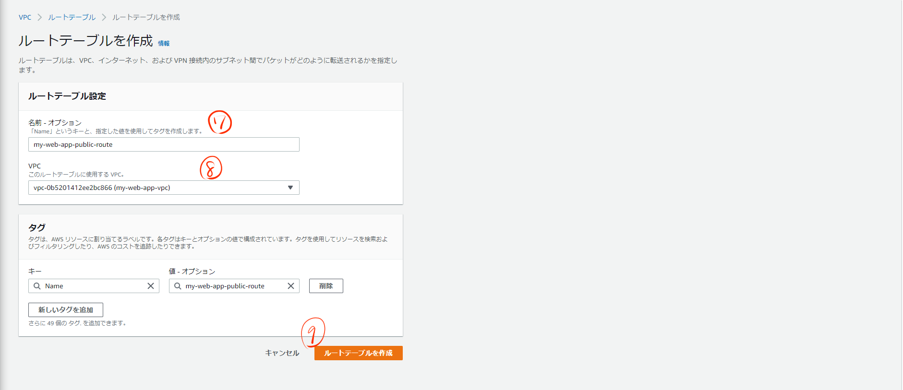
   10. 作成したルートテーブルをクリックし、サブネットの関連付けタブをクリック
   11. サブネットの関連付けを編集をクリック
   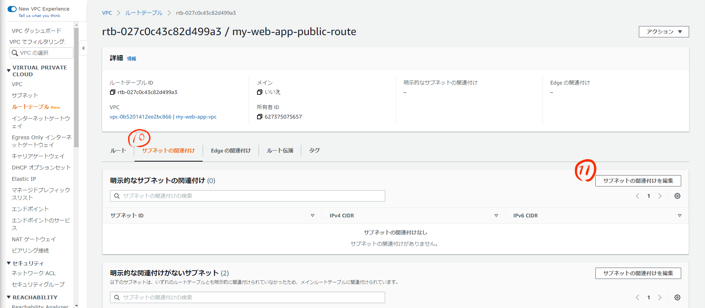
   12. ルートテーブルに関連付けたいサブネットをチェック(※チェックするサブネットを間違ってます)
   13. 関連付けを保存をクリック
   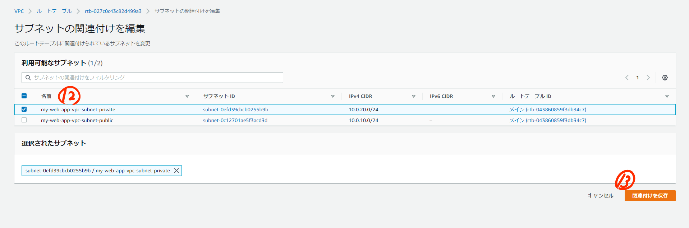
   14. ルーティングテーブルのルートを編集をクリック
   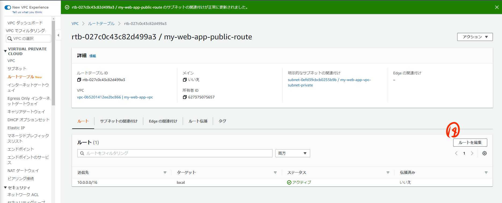
   15. インターネットゲートウェイへのルートを追加
   16. 変更を保存をクリック
   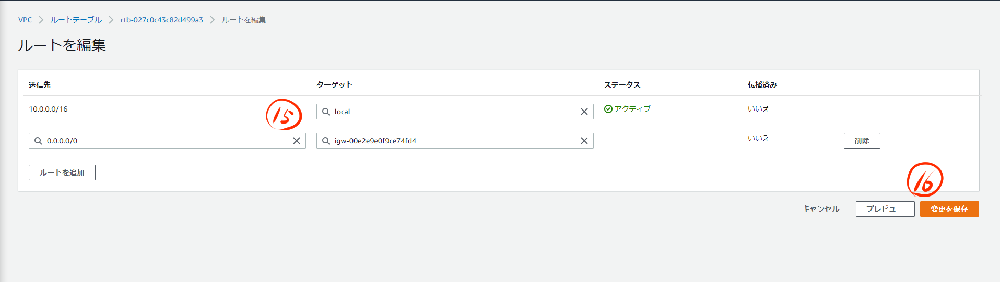
